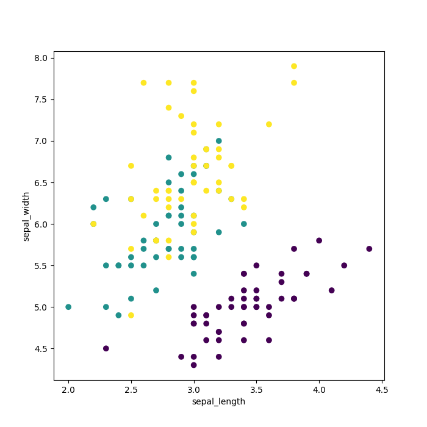
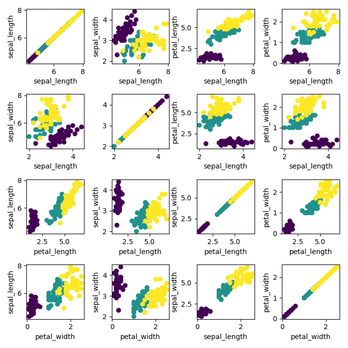
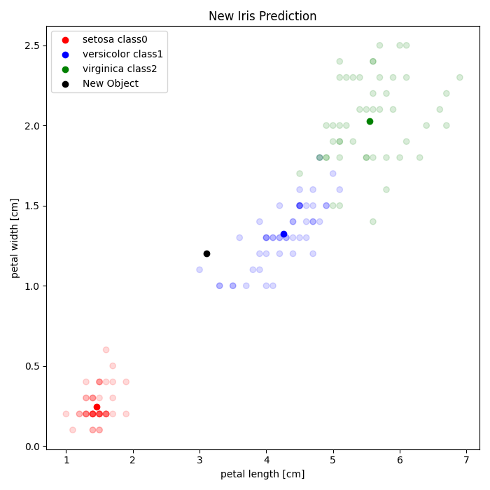

## Introdution - Classification
Iris database include three type of iris (setosa, versicolor and virginica). Each of these folower can be identified by four features.

- sepal_length [cm]
- sepal_width [cm]
- petal_length [cm]
- petal_width [cm]
## Exercise 1.

- Read data from file
- Preapare data for visualisation
- Create chart of two features

## Exercise 2.

- Read data from file
- Preapare data for visualisation
- Create chart of each combination of features

## Exercise 3.

- Read data from file
- Preapare data for visualisation
- Calculate location of centroids
- Calculate and select nearest distance of new iris from each class

